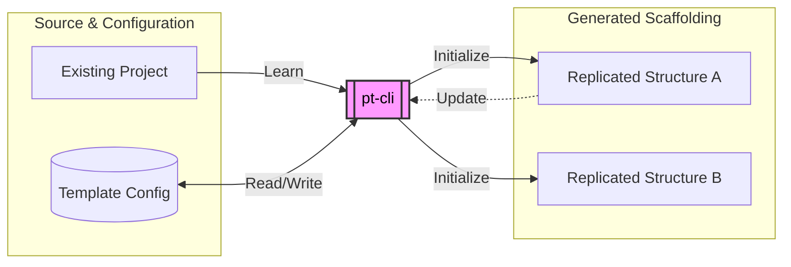

# pt - Project Template CLI

A lightweight, cross-platform CLI tool to record existing directory structures as reusable templates and quickly initialize new projects from them.



<!-- TOC -->

- [pt - Project Template CLI](#pt---project-template-cli)
    - [Why pt-cli?](#why-pt-cli)
    - [Core Benefits & Uses](#core-benefits--uses)
        - [🚀 Low-Friction Templating](#-low-friction-templating)
        - [🧠 Reduces Cognitive Load](#-reduces-cognitive-load)
        - [📦 Sharing is Caring](#-sharing-is-caring)
        - [🤖 Agentic and API Friendly](#-agentic-and-api-friendly)
    - [Features at a Glance](#features-at-a-glance)
    - [Quick Start](#quick-start)
        - [Installation](#installation)
        - [Basic Commands](#basic-commands)
    - [Agent Integration](#agent-integration)
    - [Documentation](#documentation)
    - [Development](#development)
    - [Where are the Templates?](#where-are-the-templates)

<!-- /TOC -->

## Why pt-cli?

Traditional project templating often tightly couples logic and configuration, meaning every new template requires code changes. `pt-cli` breaks that ceiling by separating project definitions from the underlying logic.

Instead of writing complex, hard-coded configuration files to scaffold new work, `pt-cli` allows you to **"learn"** from your existing project directories and turn them into  templates. It doesn't enforce a specific folder structure; it supports *your* existing patterns.

## Core Benefits & Uses

### 🚀 Low-Friction Templating

Stop recreating folder structures manually or editing shell scripts. `pt learn` saves the exact shape of any existing project. If you have a workspace organized the way you like it, `pt-cli` can help you turn it into a reusable template.

### 🧠 Reduces Cognitive Load

Standardization is key to lowering the friction of starting new work. By ensuring a predictable architecture, you can rely on downstream automation. When your folder layout is consistent, scripts for tasks like image conversion, generating dailies, or compiling documentation run flawlessly.

### 📦 Sharing is Caring

Templates can be exported as plain-text JSON files (`.pt-template.json`). This makes them completely self-describing, easy to share with your team, version control, or pull directly from remote repositories without vendor lock-in.

### 🤖 Agentic and API Friendly

`pt-cli` fully supports headless operation via non-interactive flags (`--yes`, `--vars`). It includes an official operator skill, allowing AI agents to autonomously lay down standardized boilerplate and capture new architectures you develop together. 

Prefer a graphical interface, an [official GUI](https://garylritchie.gumroad.com/l/pt-gui) is available.


## Features at a Glance

* **Learn Any Structure:** Learn any directory structure and save it as a reusable template.
* **Remote Templates:** Learn templates directly from a remote repository or archive URL.
* **Variable Injection:** Define template variables for dynamic file customization. Automatically scans text files for `{{ var }}` syntax during `learn`/`update`.
* **Automated Setup:** Auto-detect and suggest post-config setup tasks (e.g., `npm install`, `git init`, Python virtual environments).
* **Global Configuration:** Configure global post-config tasks in `~/.pt/config.yaml` to apply them to all projects automatically.
* **Direct Scaffolding:** Initialize projects directly from a JSON file without registering them in your config.

## Quick Start

### Installation

```bash
npm i -g @garyr/pt-cli 
# ...or clone this repository, then:
# cd pt-cli && npm install && npm run build && npm link

```

### Basic Commands

```bash
# Learn an existing local project structure
pt learn /path/to/PROJECT

# Learn a template from a remote repository (e.g. GitHub, Gitea, or path to tarball)
pt learn https://github.com/garyritchie/pt_godot

# Scaffold a new project from a learned template
pt init <template_name> /path/to/NEW_PROJECT

# List available templates and configurations
pt config

# Export an existing template as JSON
pt config my-template --json > my-template.json

# Import a template from JSON
pt add my-new-template --file my-new-template.json

# Scaffold directly from a JSON file (no config registration required)
pt init ./new-project --file my-template.json --yes

```

## Agent Integration

`pt-cli` is fully compatible with AI agents. By utilizing non-interactive flags (`--yes`, `--vars`, `--name`, `--desc`), agents can autonomously scaffold and learn projects without hanging on interactive terminal prompts.

An official agent skill is included in this repository: [`skills/agency-pt-operator/SKILL.md`](skills/agency-pt-operator/SKILL.md).

Equipping your agent with this skill allows it to automatically use `pt-cli` to construct standardized workspaces and record new architectures as you build them.

## Documentation

* **[Detailed Usage](doc/usage.md)** - Learn, Initialize, Update, and Remove commands.
* **[Configuration Guide](doc/configuration.md)** - Template variables, post-config tasks, file copying, and more.
* **[Exclusions](doc/exclusions.md)** - Learn about default ignored files and how to set custom patterns.

*(Note: Update the hash links above to point to your specific documentation files/wikis if applicable)*

## Development

* `src/index.ts`: Entry point and command registration.
* `src/commands/`: Individual command handler modules.
* `src/config.ts`: Configuration loading, saving, and type definitions.

**Technical Notes:**

* **ESM Migration:** The project is now pure ESM. All internal imports must use the `.js` extension.
* **Development Tooling:** Use `tsx` for running `.ts` files directly (`npm run dev`).
* **Building:** Use `tsc` to compile to `dist/`.

## Where are the Templates?

The way you organize your workspace is highly personal. A folder hierarchy that makes perfect sense for a VFX pipeline might look entirely backwards for a company branding project.

Because `pt-cli` is built around flexibility, the app purposefully avoids imposing [strong opinions](https://lyonritchie.com/lab/project-template-cli) or hardcoded structures out of the box. Instead, it empowers you to learn and share exactly what works for your specific needs.

* **[Example Templates](https://github.com/search?q=topic%3Atemplate-project+org%3Agaryritchie&type=Repositories):** We have provided a few templates based on our own workflows to get you started. These include helpful Python scripts for streamlining common tasks, such as downloading the latest version of Blender or pruning unused folders from a project.
* **[Share Your Own](https://github.com/garyritchie/pt-cli/discussions):** Have you built a project structure that works perfectly for your niche? Join us in GitHub Discussions to share your templates and see how others are organizing their work.
