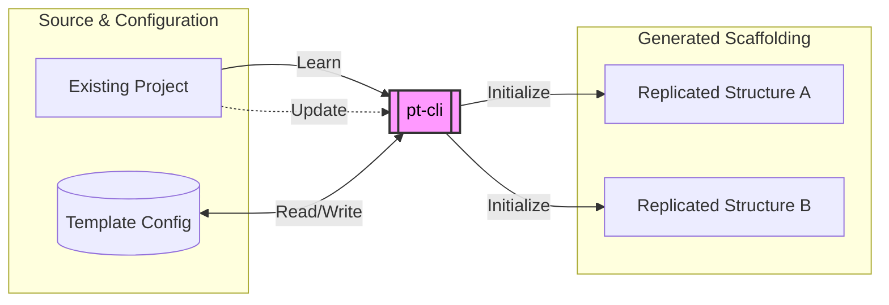

# pt - Project Template CLI

A CLI tool to record directory structures as templates and initialize new projects from them.



## The Pipeline Benefit

`pt-cli` is built to reduce boilerplate setup and ensure consistency across your workspaces. In a production pipeline, standardization is key to lowering the friction of cognitive load. `pt` helps by:

- **Instantly replicating proven architectures:** Stop recreating folder structures manually. `pt learn` saves the shape of any project.
- **Automating the setup grind:** With post-config tasks, `pt init` can run commands like `npm install`, `git init`, or setup python virtual environments for you.
- **Global post-config:** Configure shared tasks (e.g. `git init`, `git lfs install`) once in `~/.pt/config.yaml` and have them apply to every new project automatically.
- **Agentic automation:** Fully supports headless operation via non-interactive flags and includes a skill for integration with AI agents.
- **File copying & templating:** Beyond directories, it allows injecting variables into key files (`package.json`, `README.md`, etc.) and automatically ports over executable scripts.

## Features at a Glance

- Learn any directory structure and save it as a reusable template
- Initialize new projects from learned templates
- Define template variables for dynamic file customization
- **Automatic Variable Detection:** Scans text files for `{{ var }}` syntax during `learn`/`update`
- Auto-detect and suggest post-config setup tasks
- Configure global post-config tasks in `~/.pt/config.yaml` (apply to all projects)
- Baked-in defaults for common project types (javascript, python, godot, etc.)
- Share templates or use as an API with JSON export/import
- Fully supports non-interactive mode (`--yes`, `--vars`) for AI agent automation

## Quick Start

### Installation

```bash
npm i @garyr/pt-cli

# ...or clone this repository, then:
cd pt-cli
npm install
npm run build
npm link
```

### Basic Commands

```bash
# Learn an existing project structure
pt learn /path/to/PROJECT

# Scaffold a new project from a template
pt init <template_name> /path/to/NEW_PROJECT

# List available templates and configurations
pt config

# Export an existing template as JSON
pt config my-template --json > my-template.json

# Import a template from JSON
pt add my-new-template --file my-new-template.json
```

## Documentation

- [Detailed Usage](doc/usage.md) - Learn, Initialize, Update, and Remove commands.
- [Configuration Guide](doc/configuration.md) - Template variables, post-config tasks, file copying, and more.
- [Exclusions](doc/exclusions.md) - Learn about default ignored files and how to set custom patterns.

## Development

### Project Structure

- `src/index.ts`: Entry point and command registration.
- `src/commands/`: Individual command handler modules.
- `src/config.ts`: Configuration loading, saving, and type definitions.

### Technical Notes

- **ESM Migration**: The project is now pure ESM. All internal imports must use the `.js` extension.
- **Development Tooling**: Use `tsx` for running `.ts` files directly (`npm run dev`).
- **Building**: Use `tsc` to compile to `dist/`.

## Agent Integration

`pt-cli` is compatible with AI agents. By utilizing the non-interactive flags (`--yes`, `--vars`, `--name`, `--desc`), agents can autonomously scaffold and learn projects without hanging on interactive terminal prompts.

An official agent skill is included in this repository: [`skills/agency-pt-operator/SKILL.md`](skills/agency-pt-operator/SKILL.md).

Equipping your agent with this skill allows it to automatically use `pt-cli` to lay down standardized boilerplate and capture new architectures you develop together.
