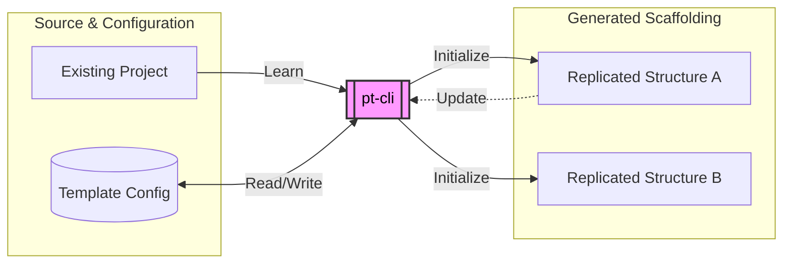

# pt - Project Template CLI

A lightweight, cross-platform CLI tool to record existing directory structures as reusable templates and quickly initialize new projects from them.


```mermaid
graph LR
    subgraph Inputs ["Source & Configuration"]
        Existing[Existing Project]
        Config[(Template Config)]
    end
    
    Engine[[pt-cli]]
    
    subgraph Outputs ["Generated Scaffolding"]
        RSA[Replicated Structure A]
        RSB[Replicated Structure B]
    end
    
    %% Flow logic
    Existing -- Learn --> Engine
    Config <-- Read/Write --> Engine
    Engine -- Initialize --> RSA
    Engine -- Initialize --> RSB
    
    %% Separate the Update logic to avoid crossing lines
    RSA -. Update .-> Engine
    
    style Engine fill:#f9f,stroke:#333,stroke-width:2px,color:#000
```

<!-- TOC -->

- [pt - Project Template CLI](#pt---project-template-cli)
  - [Why pt-cli?](#why-pt-cli)
  - [Core Benefits & Uses](#core-benefits--uses)
    - [🚀 Low-Friction Templating](#-low-friction-templating)
    - [🧠 Reduces Cognitive Load](#-reduces-cognitive-load)
    - [📦 Sharing is Caring](#-sharing-is-caring)
    - [🤖 Agentic and API Friendly](#-agentic-and-api-friendly)
  - [Features at a Glance](#features-at-a-glance)
  - [Quick Start](#quick-start)
    - [Installation](#installation)
    - [Basic Commands](#basic-commands)
    - [Shell Completions](#shell-completions)
  - [Agent Integration](#agent-integration)
  - [Documentation](#documentation)
  - [Development](#development)
  - [Where are the Templates?](#where-are-the-templates)
  - [Release & API Stability](#release--api-stability)
    - [🔒 Stability Guarantee (1.x series)](#-stability-guarantee-1x-series)
    - [📦 Versioning Policy](#-versioning-policy)
    - [📋 What's Locked in 1.0](#-whats-locked-in-10)
    - [📖 Migration from 0.x to 1.0](#-migration-from-0x-to-10)

<!-- /TOC -->

## Why pt-cli?

Traditional project templating often tightly couples logic and configuration, meaning every new template requires code changes. `pt-cli` breaks that ceiling by separating project definitions from the underlying logic.

Instead of writing complex, hard-coded configuration files to scaffold new work, `pt-cli` allows you to **learn** from your existing project directories and turn them into  templates. It doesn't enforce a specific folder structure; it supports *your* existing patterns.

## Core Benefits & Uses

### 🚀 Low-Friction Templating

Stop recreating folder structures manually or editing shell scripts. `pt learn` saves the exact shape of any existing project. If you have a workspace organized the way you like it, `pt-cli` can help you turn it into a reusable template.

### 🧠 Reduces Cognitive Load

Standardization is key to lowering the friction of starting new work. By ensuring a predictable architecture, you can rely on downstream automation. When your folder layout is consistent, scripts for tasks like image conversion, generating dailies, or compiling documentation run flawlessly.

### 📦 Sharing is Caring

Templates can be exported as JSON configuration files via `pt config <name> --json > .pt-template.json`. This exports the template's structure (folders, files to copy), variables, and post-config tasks — but *not* the actual file contents.

For fully self-contained distribution, commit the template's source directory alongside its JSON config.

### 🤖 Agentic and API Friendly

`pt-cli` fully supports headless operation via non-interactive flags (`--yes`, `--vars`). It includes an official operator skill, allowing AI agents to autonomously lay down standardized boilerplate and capture new architectures you develop together. 

Prefer a graphical interface, an [official GUI](https://garylritchie.gumroad.com/l/pt-gui) is available.


## Features at a Glance

- **Learn Any Structure**: Learn any directory structure and save it as a reusable template.
- **Remote Templates**: Learn templates directly from a remote repository or archive URL.
- **Variable Injection**: Define template variables for dynamic file customization. Automatically scans text files for `{{ var }}` syntax during `learn`/`update`.
- **Automated Setup**: Auto-detect and suggest post-config setup tasks (e.g., `npm install`, `git init`, Python virtual environments).
- **Global Configuration**: Configure global post-config tasks in `~/.pt/config.yaml` to apply them to all projects automatically.
- **Direct Scaffolding**: Initialize projects directly from a JSON file without registering them in your config.
- **Multi-Template Initialization**: Initialize from multiple templates at once (`pt init base addon my-project`), combining folders, files, variables, and post-config with collision detection and README auto-renaming.
- **Task Deduplication**: Post-config tasks with identical command+description are deduplicated across templates, executing each unique task only once with a single security prompt.
- **Post-Config Variable Support**: `pt init` now substitutes template variables into `post_config` commands, scripts, and descriptions; variable pre-filling from `.env` files and `--vars` CLI flags even when templates don't define a `variables` block; hyphenated variable name support (`[a-zA-Z0-9_-]+`).

## Quick Start

### Installation

```bash
npm i -g @garyr/pt-cli 
# ...or clone this repository, then:
# cd pt-cli && npm install && npm run build && npm link

```

### Basic Commands

```bash
# Learn an existing local project structure
pt learn /path/to/PROJECT

# Learn a template from a remote repository (e.g. GitHub, Gitea, or path to tarball)
pt learn https://github.com/garyritchie/pt_godot

# Scaffold a new project from one or more learned templates
pt init <template_name> [template_name2...] /path/to/NEW_PROJECT

# List available templates and configurations
pt config

# Export an existing template as JSON
pt config my-template --json > my-template.json

# Import a template from JSON
pt add my-new-template --file my-new-template.json

# Scaffold directly from a JSON file (no config registration required)
pt init ./new-project --file my-template.json --yes
```

### Shell Completions

Generate and install tab completions:

```bash
# Bash
pt completion bash > /etc/bash_completion.d/pt
# Or user-local: pt completion bash > ~/.local/share/bash-completion/completions/pt

# Zsh
pt completion zsh > ~/.zsh/completions/_pt
# Add to ~/.zshrc: fpath=(~/.zsh/completions $fpath)
# autoload -U compinit && compinit

# Fish
pt completion fish > ~/.config/fish/completions/pt.fish
```

Template names auto-complete dynamically for `pt init`, `pt update`, `pt config`, and `pt remove`.

## Agent Integration

`pt-cli` is fully compatible with AI agents. By utilizing non-interactive flags (`--yes`, `--vars`, `--name`, `--desc`), agents can autonomously scaffold and learn projects without hanging on interactive terminal prompts.

An official agent skill is included in this repository: [`skills/agency-pt-operator/SKILL.md`](skills/agency-pt-operator/SKILL.md).

Equipping your agent with this skill allows it to automatically use `pt-cli` to construct standardized workspaces and record new architectures as you build them.

## Documentation

* **[Detailed Usage](doc/usage.md)** - Learn, Initialize, Update, and Remove commands.
* **[Configuration Guide](doc/configuration.md)** - Template variables, post-config tasks, file copying, and more.
* **[Security Guide](doc/security.md)** - Command validation, trusted sources, audit logging.
* **[Testing Guide](doc/testing.md)** - Test suite structure and running tests.
* **[Exclusions Reference](doc/exclusions.md)** - Default ignored files and custom patterns.
* **[Variable Substitution Example](doc/variable_substitution_example.md)** - Practical examples.

## Development

* `src/index.ts`: Entry point and command registration.
* `src/commands/`: Individual command handler modules.
* `src/config.ts`: Configuration loading, saving, and type definitions.

**Technical Notes:**

* **ESM Migration:** The project is now pure ESM. All internal imports must use the `.js` extension.
* **Development Tooling:** Use `tsx` for running `.ts` files directly (`npm run dev`).
* **Building:** Use `tsc` to compile to `dist/`.

## Where are the Templates?

The way you organize your workspace is highly personal. A folder hierarchy that makes perfect sense for a VFX pipeline might look entirely backwards for a company branding project.

Because `pt-cli` is built around flexibility, the app purposefully avoids imposing [strong opinions](https://lyonritchie.com/lab/project-template-cli) or hardcoded structures out of the box. Instead, it empowers you to learn and share exactly what works for your specific needs.

* **[Example Templates](https://github.com/search?q=topic%3Atemplate-project+org%3Agaryritchie&type=Repositories):** We have provided a few templates based on our own workflows to get you started. These include helpful Python scripts for streamlining common tasks, such as downloading the latest version of Blender or pruning unused folders from a project.
* **[Share Your Own](https://github.com/garyritchie/pt-cli/discussions):** Have you built a project structure that works perfectly for your niche? Join us in GitHub Discussions to share your templates and see how others are organizing their work.
* **[Learn from the Pros](https://pt-gallery.lyonritchie.com/):** Explore project folder structures based on examples from fellow professionals across creative industries.

## Release & API Stability

**pt-cli v1.0.0** marks the first stable release with a locked public API. This means:

### 🔒 Stability Guarantee (1.x series)

- **No breaking changes** to CLI command signatures, flags, or config schema (`~/.pt/config.yaml`) within the 1.x series
- **No breaking changes** to the JSON template format (`.pt-template.json` / `template.json`)
- **No breaking changes** to the Node.js programmatic API (if used as a library)

### 📦 Versioning Policy

| Version | Meaning |
|---------|---------|
| **MAJOR** (1.0 → 2.0) | Breaking changes to CLI, config schema, or JSON template format |
| **MINOR** (1.0 → 1.1) | New features, commands, or config options (backward compatible) |
| **PATCH** (1.0 → 1.0.1) | Bug fixes, security patches, documentation updates |

### 📋 What's Locked in 1.0

**CLI Commands & Flags:**
```bash
pt learn [path] [--ignore] [--name] [--desc] [--yes] [--json] [--allow-untrusted] [--no-diff]
pt init [template] [dest] [--file] [--skip-post-config] [--dry-run] [--yes] [--vars]
pt update <template> [path] [--ignore] [--desc] [--yes] [--no-diff]
pt config [template] [--json]
pt add <name> [--file] [json]
pt remove <template> [--yes]        # alias: pt rm
pt variables [--set] [--delete] [--json]
pt default-post-config [--set --json]
pt ignore [patterns] [--set]
pt security-response <response>
pt completion <shell>
```

**Config Schema (`~/.pt/config.yaml` v3.0):**
```yaml
version: "3.0"
templates: { <name>: TemplateConfig }
default_post_config: PostConfigTask[]
ignore: string[]
variables: TemplateVariable[]
security: SecurityPolicy  # optional
```

**TemplateConfig (per-template):**
```yaml
description: string
templateRoot?: string
variables?: TemplateVariable[]
folders: FolderNode[]
exclude?: string[]
copy_files?: CopyFileEntry[]
post_copy?: PostCopyFile[]
post_config?: PostConfigTask[]
```

**JSON Template Format (`.pt-template.json`):**
```json
{
  "name": "template-name",
  "description": "Template description",
  "variables": [{ "name": "", "prompt": "", "default": "", "required": false }],
  "folders": [{ "name": "", "info": "", "children": [] }],
  "copy_files": [{ "src": "", "dest": "", "substitute_variables": false, "chmod": "" }],
  "post_config": [{ "command": "", "description": "", "type": "", "always_prompt": false, "script": "", "cross_platform": false, "checked": true }],
  "post_copy": [{ "src": "", "dest": "" }]
}
```

### 📖 Migration from 0.x to 1.0

If you're upgrading from a 0.x version:

1. **Config auto-migrates** — `pt` automatically upgrades your `~/.pt/config.yaml` from v2.0 → v3.0 on first run (renames `name` → `description`, removes `type`, migrates `global_post_config` → `default_post_config`, normalizes variables)
2. **No action needed** — Just run any `pt` command; migration happens silently with a backup (`.bak`) created
3. **CLI flags unchanged** — All 0.x flags work identically in 1.0

**Breaking changes from 0.x already landed in 0.30+:**
- Config version 3.0 (v0.30+)
- `default_post_config` replaces `global_post_config` (v0.30+)
- Additive diff mode for `pt update` (v0.38+)
- Nested variable expansion (v0.36+)
- `.env` file scanning for defaults (v0.36+)

If you skipped intermediate 0.x versions, the auto-migration handles everything.
